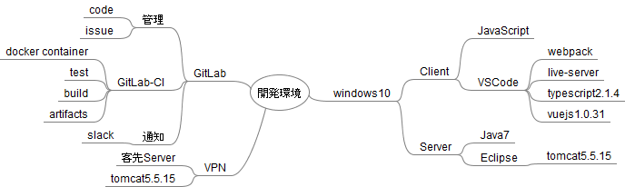

# 2017spring

20 June 2017 18:00~

# 発表内容

## テストとCIの話

[テストとCIの話 by yymm](http://slides.com/yymm/test-and-ci#/ "テストとCIの話 by yymm")

## Python で ユニットテスト

[Python で ユニットテスト by dnaga392](https://dnaga392.github.io/devipl170620/ "Python で ユニットテスト by dnaga392")

## Vue.jsでの開発環境

by dg

## Chromebookを開発環境にする

[Chromebookを開発環境にする by miyazaki](https://scrapbox.io/ipl/devipl170620miyazakiスライド)

## canvasでパーティクルする話

[派手なものを作ろう](https://scrapbox.io/ipl/devipl-20170620-particle)

## Rはどのようにしてfor文を避けているか

[Rはどのようにしてfor文を避けているか.ipynb](https://github.com/DevIPL/2017spring/blob/master/R%E3%81%AF%E3%81%A9%E3%81%AE%E3%82%88%E3%81%86%E3%81%AB%E3%81%97%E3%81%A6for%E6%96%87%E3%82%92%E9%81%BF%E3%81%91%E3%81%A6%E3%81%84%E3%82%8B%E3%81%8B.ipynb)

## 多変数公開鍵暗号
[大学でやったこと](http://192.168.5.56/ito/Devipl/blob/master/20170620devipl_%E5%A4%9A%E5%A4%89%E6%95%B0%E5%85%AC%E9%96%8B%E9%8D%B5%E6%9A%97%E5%8F%B7.pdf)
